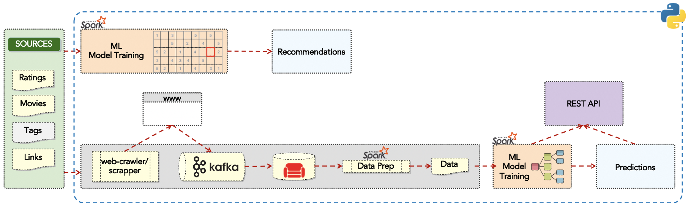

# Spark ML Movies Recommendation and Budget Forecast

## About
A demo Python application with web-scrapping/crawler, Kafka, couchdb and SparkML using the famous Movielens dataset using Raspberry Pi Cluster.

## Instructions